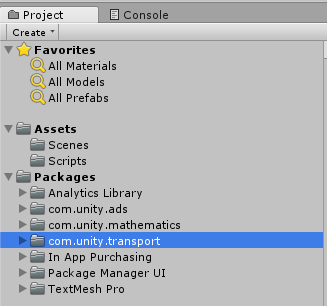

# Installing com.unity.transport

> **Note**: Before you continue, make sure you have [git](https://git-scm.com/) installed and configured.

Open up a terminal and navigate to where you want to have your samples root folder and run the command: 

`$ git clone https://github.com/Unity-Technologies/multiplayer`

This command makes git clone the repository into a folder called _multiplayer_.

## Setup a project in Unity

Start up the Unity Editor and begin by creating a __New Project__. Set the project location to the same root folder as the cloned `multiplayer` repository, name it _client-server_. Your root should look something like this:

```
client-server/
multiplayer/
```

Update the manifest file inside the _Packages_ folder, so it points to our newly downloaded preview package.  

Open up the _Packages/manifest.json_ file in your favorite editor and, inside the `{}` under `"dependencies"`, add the line: `"com.unity.transport": "file:../../multiplayer/com.unity.transport",`  

The path `"../../multiplayer"` is relative, this means that if you go two levels up in the folder structure there should be a folder called _multiplayer_. See overview below:

```
:.                         
├───client-server           
│   ├───Assets              
│   │   ├───Scenes          
│   │   └───Scripts         
│   ├───Packages            <- We are here.
│   │       manifest.json   
│   │                       
│   └───ProjectSettings     
└───multiplayer        
    ├───com.unity.transport <- We want to point to here.
    └───network.bindings    
```

> Note: In some cases, you might also need to add the line `"com.unity.mathematics": "0.0.12-preview.19",` to your manifest file. If so, set the __Scripting Runtime Version__ to __.NET 4.x Equivalent__. You can find these settings under __Edit__ > __Project Settings__ > __Player__ > __Configuration__.

Your file should now look something like this:  

Filename: _Packages/manifest.json_

```json
{
  "dependencies": {
    "com.unity.transport": "file:../../multiplayer/com.unity.transport",
    "com.unity.mathematics": "0.0.12-preview.19",
    "com.unity.ads": "2.0.8",
    ...
    "com.unity.modules.xr": "1.0.0"
  }
}
```

Go back to the Editor, and you should see it reloading. When finished, you can open up the __Packages__ tree inside the __Project__ view and find a new package called `com.unity.transport`.



You should see a message indicating that there were no errors. If so, you are ready to go on to the next phase. 

> Note: If you encounter errors, please [report an issue](https://github.com/Unity-Technologies/multiplayer/issues) in the repository.


[Back to table of contents](TableOfContents.md)